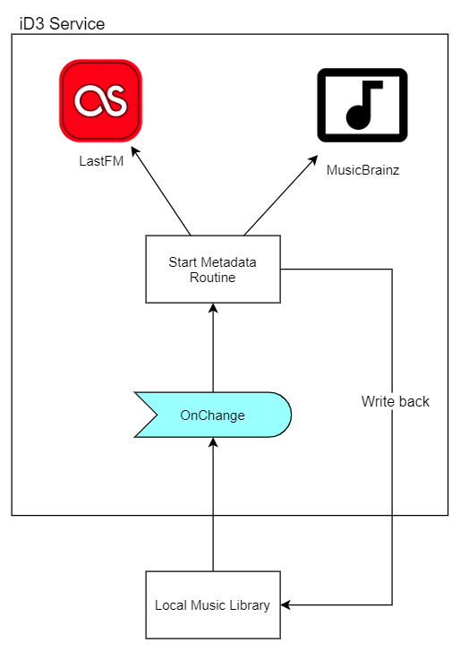

# iD3 Service
ID3 Tag Metadata Service to add Metadata information from LastFM to your local music Library.



## Install
**Register as Windows Service**

With `installutil`
```batch
"C:\Windows\Microsoft.NET\Framework\v4.0.30319\installutil.exe" "c:\path\to\iD3.Service.exe"
```

With `SC`
```batch
SC CREATE "iD3 Metadata Service" binpath= "C:\path\to\iD3.Service.exe"
```

## Uninstall
```batch
"C:\Windows\Microsoft.NET\Framework\v4.0.30319\installutil.exe" -u "c:\path\to\iD3.Service.exe"
```

## Configure
You need to specify the path to your local Media in the `App.config` file.

>You need to add the fllowing to the config
```xml
<appSettings>
    <add key="Path" value="C:\path\to\your\library" />
</appSettings>
```

Now you can controll the service via services.msc